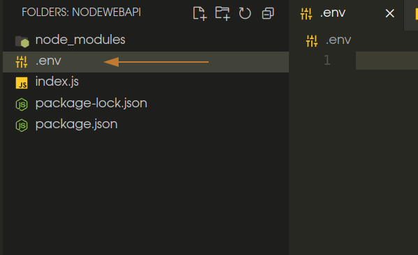

# How to CRUD: Node + Express + MySQL
### Baseado no [tutorial](https://www.youtube.com/watch?v=iA0wZehe82w) do Youtube.

#### 1 - Navegar até onde se deseja criar o projeto, criar uma pasta com o nome do projeto. Ex: "nodewebapi" e abrir a pasta no VSCode

#### 2 - Abrir terminal do VS code e inserir
```bash
npm init -y
```

para iniciar um projeto node vazio

#### 3 - Instalar Express + Dotenv

```bash
npm install express dotenv
```

#### 4 - Criar arquivo `index.js` na pasta raiz do projeto.

Sua estrutura de arquivos deve estar assim


#### 5 - Escrever o basico do servidor
```js
// importa o express
const express = require("express")

// inicializa o express
const app = express()

// Configura o app para escutar na porta 3000
app.listen(3000)
```

#### 6 - Configurar  arquivo .env
6.1 -Crie um arquivo com o nome ".env" a raiz do seu projeto.


Este arquivo deverá conter as informações de configurações do servidor. Por exemplo a porta onde o servidor irá escutar que esta escrita manualmente em `app.listen(3000)`

6.2 - Adicione a chave:valor abaixo ao arquivo .env e salve-o:
```json
PORT=3000
```

#### 7 - Importar dotenv e alterar index.js
index.js
```js
// importa e configura o dotenv
require("dotenv").config();

// importa o express
const express = require("express")

// inicializa o express
const app = express()

// Configura o app para escutar na porta 3000 
// (configurada no arquivo .env)
app.listen(process.env.PORT)
```
#### 8 - Passando um callback para quando o servidor iniciar

index.js
```js
// codigos de inicialização
//            ...

// Configura o app para escutar na porta 3000 configurada no
// arquivo .env e passa uma função de callback para ser executada
// quando o servidor inicia.
app.listen(process.env.PORT, () => {
  console.log("Servidor rodando na porta: "+process.env.PORT)
})
```

Agora vamos executar esse servidor para testarmos.

#### 9 - Testando

Basta abrir o terminal do VSCode novamente e executar:
```bash
node index
```
O resultado deve ser algo do tipo:

