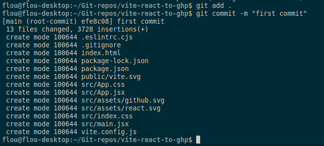
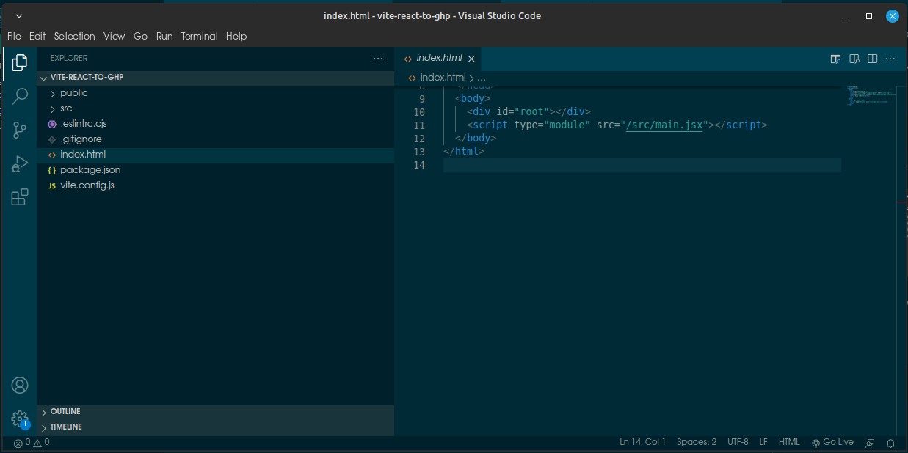
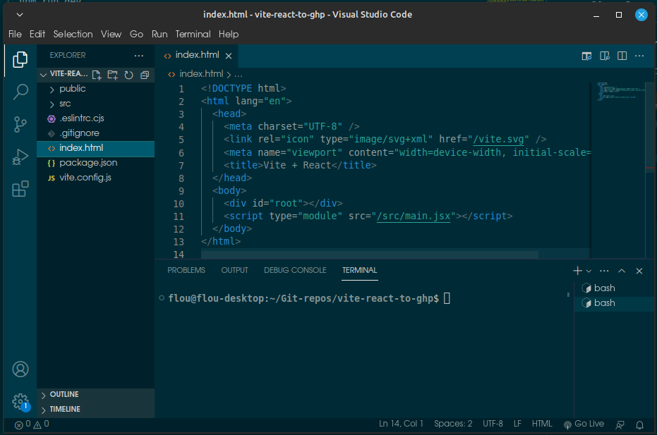
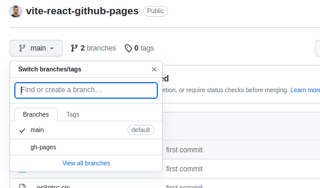
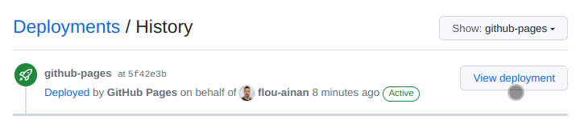
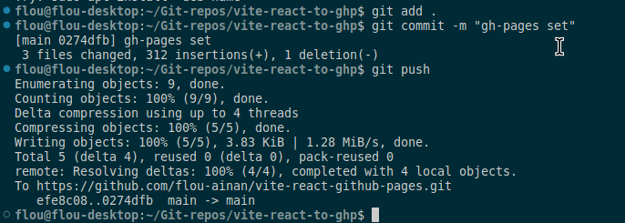

# How to Deploy a Vite + React Project on Github Pages

I'm assuming a couple of things here, if you aint got them go there and do or get them before. 
## Assumptions
- You are using a Linux Machine (Preferable a Debian Based) or know well how to use Windows shell if you are using the Microsoft System. I think everything should works fine on Mac too.
- You already have Node and npm installed in your machine. I reccomend using nvm to control the node versions.
- You already have VScode installed in your machine and know hot to use it.
- You know Vite or at least his weaker brother (my opinon) CreateReactApp
- You already understand at least a little bit of Github, React and the overall webdev context.

## Step 1
<h4>Create a React Boilerplate app with Vite</h4>

Open a terminal on your preferred projects folder


Type in ⬇️
```
npm create vite
```
Its going to ask your project name and type, in my case i'm using `vite-react-to-ghp` and `react with Javascript` as my options. 


The result shoud be something like that:

```
flou@flou-desktop:~/Git-repos$ npm create vite
✔ Project name: … vite-react-to-ghp
✔ Select a framework: › React
✔ Select a variant: › JavaScript

Scaffolding project in /home/flou/Git-repos/vite-react-to-ghp...

Done. Now run:

  cd vite-react-to-ghp
  npm install
  npm run dev


```
Now type and run
```
cd "your-project-name"
```
to enter in your new project folder

Type and run
```
ls
```
To list the folder itens and see if its worked.


Now open the project on VScode to go to next step.

Just type and run
```
code .
```


Open your VScode Terminal


Lets run the following commands
```
npm install
```


```
npm run dev
```


Hold ctrl and click on the provided link to see if everything is working fine.


If everything is fine you shoud see somethinbg like that ⬆️

## Step 2 (Optional)
<h3>Modify your App</h3>

In your VScode open the index.html on the root folder and/or App.jsx on the SRC folder and change at least a couple of things to see the changes.


## Step 3
<h3> Creating a new local repo via CLI and connecting it to Github </h3>

Access your github account on your brownser and click on  
``➕ Create New Repository``


Just add it's name and go on.

You shoud see something like that ⬇️


These are the instructions to conect to your repo but first you are going to configure your Git locally on your project folder 
<br><small> Save it for later</small>

Go back to your VScode Terminal opened on the project folder.
<p><small>
  <b>Tip:</b> Its recommended to use VScode terminal because of its integration with Github. It means you can push your code just with your Github Login, otherwise you would need to use SSH keys or manage some github credentials.
</small></p>

Run
```
git init
```

You shoud see something like that
```
flou@flou-desktop:~/Git-repos/vite-react-to-ghp$ git init
Initialized empty Git repository in /home/flou/Git-repos/vite-react-to-ghp/.git/
```
Now you are going to commit and push to the Github repository you have created.

```
  git commit -m "first commit"
  git branch -M main
  git remote add origin https://github.com/username/repo-name.git
  git push -u origin main
```
If you open your empty repository page on github you will see thesse commands already with the actual link. Use them starting with `git commit -m "first commit"` like in the example above.
```  
git add .
```
```  
git commit -m "first commit"
```



If you never used your git you should see something like that<br>


Here is how to solve it ⬇️
```
git config --global user.email "your-email"
```
```
git config --global user.name "your-username"
```
Repeat 
```  
git commit -m "first commit"
```

<b>Ignore it if you have already set it before.</b> Lets continue.

```
git branch -M main
```
```
git remote add origin https://github.com/username/repo-name.git
```
```
git push -u origin main
```


If you have done everthing right you can now go to your Github repository page and see that your project is there!

If its already opened in your browser you need to reload the page and voila!


# Step 4
<h3>Setting and Deploying to GH Pages</h3>

Lets go back to VScode Terminal on your project folder.

<b>Step 1</b> - Install the Github pages node module to your project.

```
npm install gh-pages --save-dev
```


<b>Step 2 </b> - In the package.json file add these lines before "build": "vite build",

```
"predeploy": "npm run build",
"deploy": "gh-pages -d dist",
```


<b>Step 3</b> - In the vite.config.js file add this line before plugins: [react()],
```
base: "/YOUR_REPOSITORY_NAME",
```
YOUR_REPOSITORY_NAME got to be the name of your GitHub repository.


It set, jut hit
```
npm run deploy
```
and now if you go to your github repository you shoud notice a new branch called "gh-pages"




And you should notice and gh-pages icon too


It can be "Queued", "In progress" or "Active" if it isn't wait a little bit and keep refreshing the page. When its active access it


and them click on `View Deployment`




Now its successfully deployed. Dont forget do add, commit and push your changes to the main branch.

