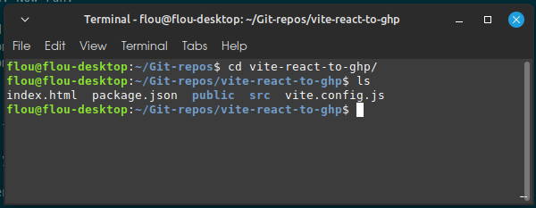
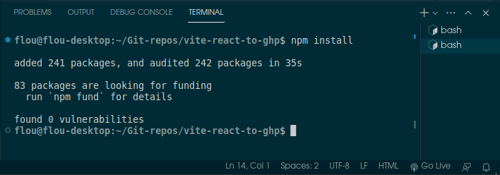
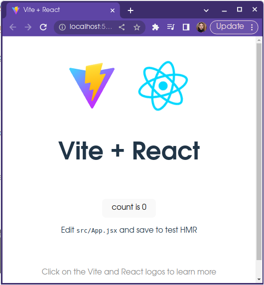
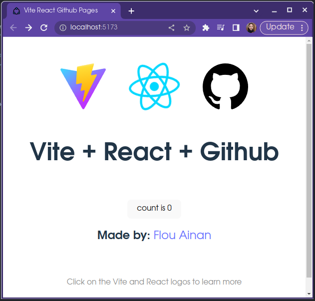
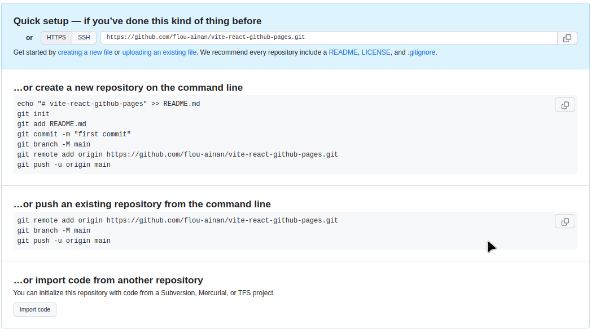

# How to Deploy a Vite + React Project on Github Pages

I'm assuming a couple of things here, if you aint got them go there and do or get them before. 
## Assumptions
- You are using a Linux Machine (Preferable a Debian Based) or know well how to use Windows shell if you are using the Microsoft System. I think everything should works fine on Mac too.
- You already have Node and npm installed in your machine. I reccomend using nvm to control the node versions.
- You already have VScode installed in your machine and know hot to use it.
- You know Vite or at least his weaker brother (my opinon) CreateReactApp
- You already understand at least a little bit of Github, React and the overall webdev context.

## Step 1
<h4>Create a React Boilerplate app with Vite</h4>

Open a terminal on your preferred projects folder


Type in ⬇️
```
npm create vite
```
Its going to ask your project name and type, in my case i'm using `vite-react-to-ghp` and `react with Javascript` as my options. 


The result shoud be something like that:

```
flou@flou-desktop:~/Git-repos$ npm create vite
✔ Project name: … vite-react-to-ghp
✔ Select a framework: › React
✔ Select a variant: › JavaScript

Scaffolding project in /home/flou/Git-repos/vite-react-to-ghp...

Done. Now run:

  cd vite-react-to-ghp
  npm install
  npm run dev


```
Now type and run
```
cd "your-project-name"
```
to enter in your new project folder

Type and run
```
ls
```
To list the folder itens and see if its worked.



Now open the project on VScode to go to next step.

Just type and run
```
code .
```


Open your VScode Terminal


Lets run the following commands
```
npm install
```


```
npm run dev
```


Hold ctrl and click on the provided link to see if everything is working fine.



If everything is fine you shoud see somethinbg like that ⬆️

## Step 2 (Optional)
<h3>Modify your App</h3>

In your VScode open the index.html on the root folder and/or App.jsx on the SRC folder and change at least a couple of things to see the changes.



## Step 3
<h3> Create a Github Repo for your App </h3>

Access your github account on your brownser and click on  
``➕ Create New Repository``


Just add it's name and go on.

You shoud see something like that ⬇️



These are the instructions to conect to your repo but first you are going to configure your Git locally on your project folder.


